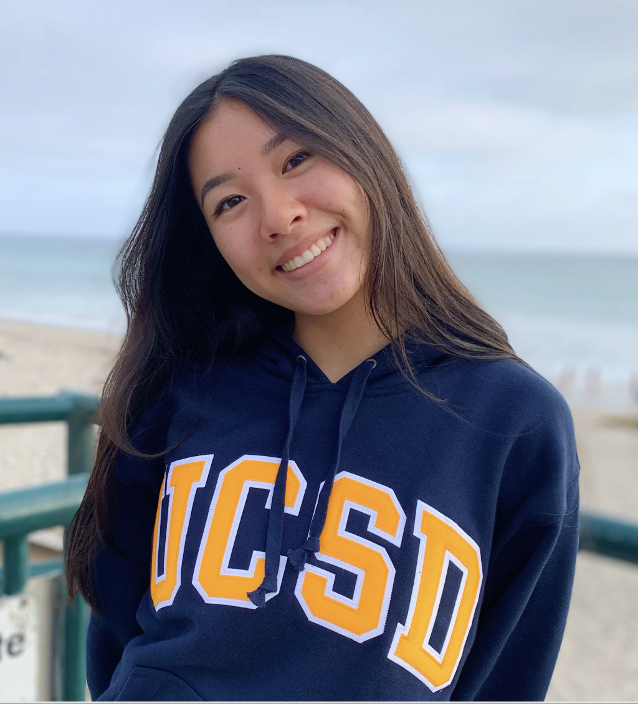

  

# ECE 196 Fall 2023

## Alexis Yu

Hello! My name is Alexis Yu. I’m currently a fourth year electrical engineering student with a depth in composter system design at UCSD. My home town is Martinez, CA which is in the Bay Area. 

  
  
  
## Joshua Park

I'm Joshua Park, a third year Computer Engineering major. I'm interested in machine learning and neuroscience, and my goal is to conduct research within both fields. I wanted to work something related to biotech for ECE 196, so I happy I found a team who also wanted to create a robotic arm. 

  
  
## Tien Vu

Hi, I’m tien vu and i’m a third year  majoring in electrical engineering with a depth in signal processing. My hometown is huntington beach, CA and I LOVE ece196.
