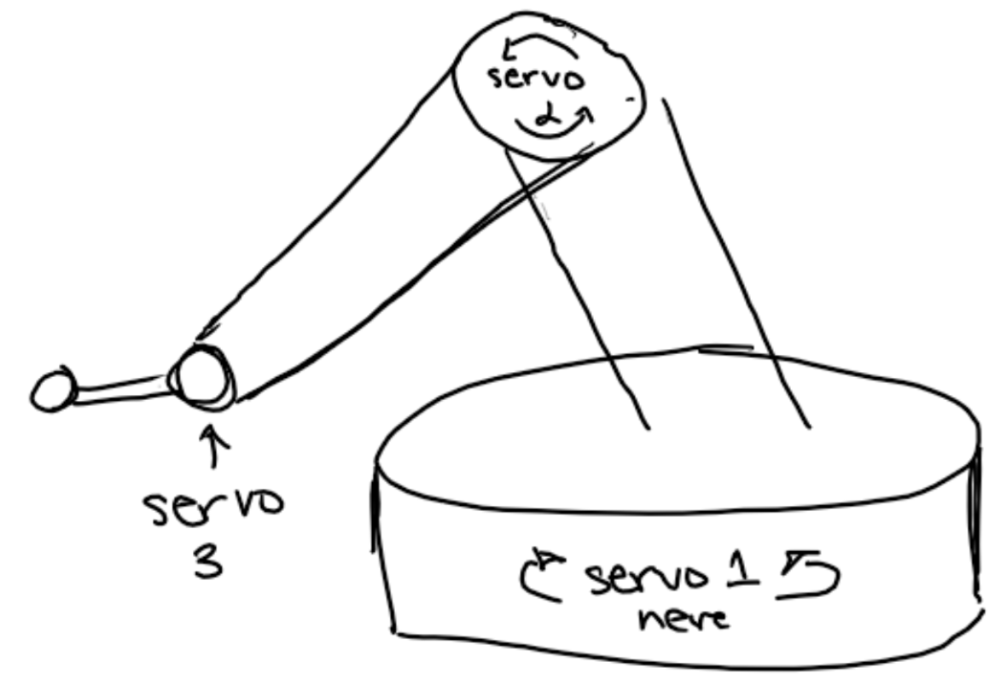

  

# ECE 196 Fall 2023

### [Team Page](https://joshjppark.github.io/ECE196/teampage.html)

# Team My Hand

## Problem Definition
There are many people who do not have full control over their hands due to a variety of reasons, such as muscle or nerve damage as well as neurodegenerative diseases. In particular people who suffer from Parkinson’s Disease or naturally shaky hands have a difficult time gripping objects with their fingers and hands. This makes it difficult to perform basic, everyday tasks such as eating.

## Proposed Idea

Our proposed solution is to make a robotic arm that will mimic the arm and hand motions associated with bringing food from a dish to the mouth. The user will be able to control the robotic arm through calibration between their mouth and food location relative to the base of the arm, or with the use of a remote control.

  
  
  

## Favorite Photos

## Video Demo
### [TBD](https://www.youtube.com/)

## Workshop Section

## Resources

#### [3 Motor Robotic Arm Model:](https://www.servomagazine.com/magazine/article/build-your-own-computer-controlled-three-axis-robotic-arm)

#### [IR Remote Sensor: ](https://www.circuitbasics.com/arduino-ir-remote-receiver-tutorial/)

#### [Model Microcontroller Properties:](https://community.robotshop.com/tutorials/show/how-to-make-a-robot-lesson-4-understanding-microcontrollers)

#### [ATmega328 Microcontroller](https://www.instructables.com/Getting-Started-With-the-ATMega328P/)

#### [Robotic Arm Design](https://www.instructables.com/DIY-Robotic-Arm/)
