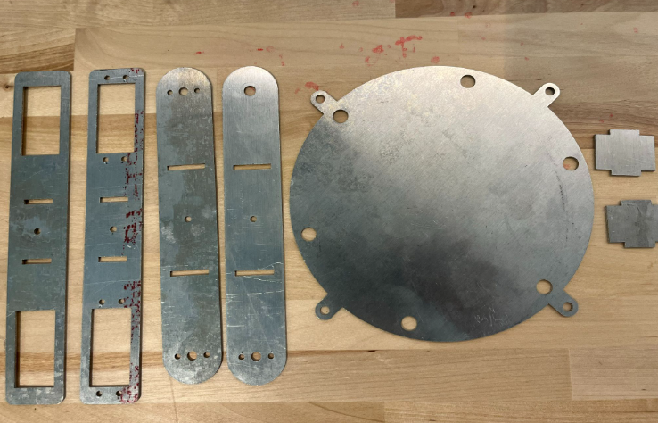
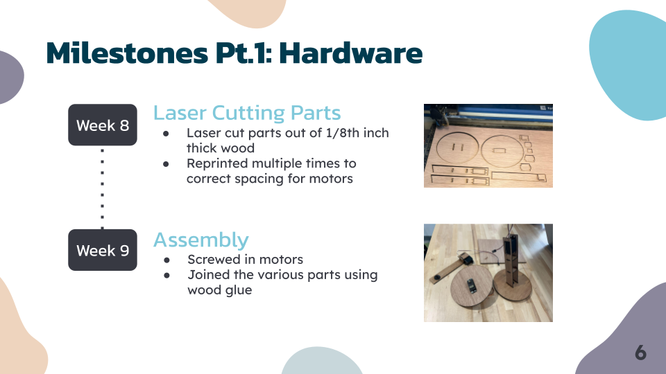

  

# ECE 196 Fall 2023

**Alexis Yu**

**Tien Vi**

**Joshua Park**

### [Team Page](https://joshjppark.github.io/ECE196/teampage.html)

# Team My Hand

## Problem Definition
There are many people who do not have full control over their hands due to a variety of reasons, such as muscle or nerve damage as well as neurodegenerative diseases. In particular people who suffer from Parkinson’s Disease or naturally shaky hands have a difficult time gripping objects with their fingers and hands. This makes it difficult to perform basic, everyday tasks such as eating.

## Proposed Idea

Our proposed solution is to make a robotic arm that will mimic the arm and hand motions associated with bringing food from a dish to the mouth. The user will be able to control the robotic arm through calibration between their mouth and food location relative to the base of the arm, or with the use of a remote control.

  
  
  

## Favorite Photos

  
  

## Slide Deck

 

## Video Demo
### [Video](https://drive.google.com/file/d/1wwP8HeFlVF7NrVt-EilVyCp93S8hTvxq/view?usp=sharing)

 

## Workshop Section
### [Workshop](https://docs.google.com/document/d/1Ay5fy3oKeEZEbP_cBYdphER7OLhBeB1FmZoi5eMDotY/edit?usp=sharing)

 

## Resources

#### [3 Motor Robotic Arm Model:](https://www.servomagazine.com/magazine/article/build-your-own-computer-controlled-three-axis-robotic-arm)

We used this website to get inspiration behind our robotic arm design, especially with the motor placements and degrees of freedom. It was guideful in explaining how to code the servo motors as well as PCB design for robotic arm components. Although we ended up laser cutting our parts, the aspect of buidling components stuck with us throughout the project.

 

#### [Robotic Arm Design](https://www.instructables.com/DIY-Robotic-Arm/)

With the previous website in mind, this website also helped us design our robotic arm. This website also designed their arm by laser cutting metal, which is where we got motivated to laser cut our components as well. We tried to first cut our parts out of metal, but we switched to wood because wood is easier to add screws and super glue together.

 

#### [IR Remote Sensor: ](https://www.circuitbasics.com/arduino-ir-remote-receiver-tutorial/)

These websites helped us understand how the IR reicever and remote control worked together to establish wireless communication. It allowed us to wire our arduino to the IR reciever to control our motors wirelessly rather than use pushbuttons or spin potentiometers. 

 

#### [Model Microcontroller Properties:](https://community.robotshop.com/tutorials/show/how-to-make-a-robot-lesson-4-understanding-microcontrollers)
#### [ATmega328 Microcontroller](https://www.instructables.com/Getting-Started-With-the-ATMega328P/)

This website guided us through the basics of microcontrollers and their properties. This enabled us to become familiar with the capabilities of our microcontrollers as well as the pros and cons of various microcontrollers. In the end, we decided to use an Arduino Uno to program our motors.
